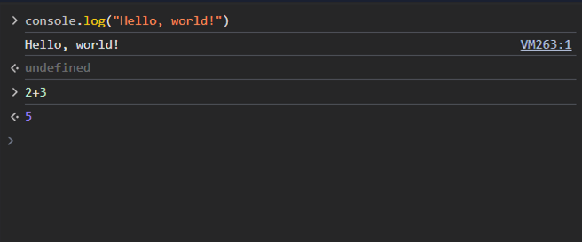
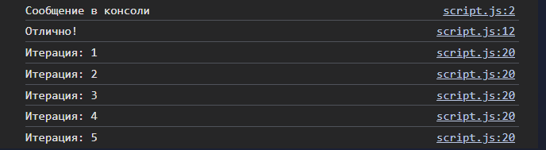

# Лабораторная работа №1. 

## Цель работы

Познакомиться с основами JavaScript, научиться писать и выполнять код в браузере и в локальной среде, разобраться с базовыми конструкциями языка.

## Условие

### Задание 1. Выполнение кода в браузере

1. Подготовка среды:

   - Установите текстовый редактор (например, `VS Code`).
   - Установите `Node.js` с официального сайта.
   - Откройте `DevTools` в браузере (нажмите `F12` и выберите вкладку `Консоль`).

2. Выполнение кода JavaScript в браузере

   - Откройте консоль разработчика (`F12` → `Console`).
   - Напишите команду `console.log("Hello, world!");` и нажмите Enter.
   - Запишите в консоли `2 + 3` и посмотрите результат.





3. Создание первой HTML-страницы с JavaScript

   - Создайте файл `index.html` и вставьте в него следующий код.

   ```html
   <!DOCTYPE html>
   <html lang="en">
     <head>
       <title>Привет, мир!</title>
     </head>
     <body>
       <script>
         alert("Привет, мир!");
         console.log("Hello, console!");
       </script>
     </body>
   </html>
   ```

   - Откройте `index.html` в браузере и посмотрите, как выполняется код.

4. Подключение внешнего JavaScript-файла

   - Создайте файл script.js и добавьте в него код:

   ```javascript
   alert("Этот код выполнен из внешнего файла!");
   console.log("Сообщение в консоли");
   ```

   - Подключите файл в `index.html`, добавив в `<head>`

   ```html
   <script src="script.js"></script>
   ```

   - Откройте страницу в браузере.

### Задание 2. Работа с типами данных

1. Объявление переменных и работа с типами данных.

   - В файле `script.js` создайте несколько переменных:

     - `name` - строка с вашим именем.
     - `birthYear` - число, представляющее год вашего рождения.
     - `isStudent` - логическая переменная, указывающая, являетесь ли вы студентом.

   - Выведите их в консоль.

2. Управление потоком выполнения (условия и циклы)

   - Добавьте следующий код в `script.js`:

   ```javascript
   let score = prompt("Введите ваш балл:");
   if (score >= 90) {
     console.log("Отлично!");
   } else if (score >= 70) {
     console.log("Хорошо");
   } else {
     console.log("Можно лучше!");
   }

   for (let i = 1; i <= 5; i++) {
     console.log(`Итерация: ${i}`);
   }
   ```

   - Откройте страницу в браузере и посмотрите, как работают условия и циклы.
   

### Контрольные вопросы

1. Чем отличается `var` от `let` и `const`?
var — устаревший способ объявления переменных. Глобальная или функциональная область видимости (не блочная). Допускает повторное объявление без ошибки. Поднимается (hoisting), но без инициализации. Можно изменять значение.

let — современный способ объявления переменных. Блочная область видимости ({}), не доступна за пределами блока. Нельзя повторно объявить в одной области видимости. Поднимается, но без инициализации (временная мертвая зона). Можно изменять значение.

const — аналогично let, но с ограничением. Нельзя переопределять значение. Если это объект или массив, можно изменять их содержимое, но не саму ссылку.

2. Что такое неявное преобразование типов в JavaScript?

3. Как работает оператор `==` в сравнении с `===`?